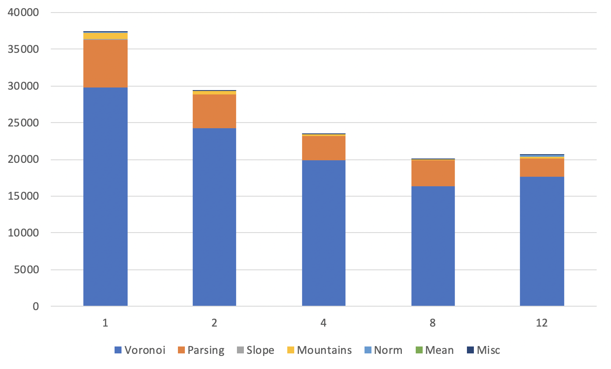
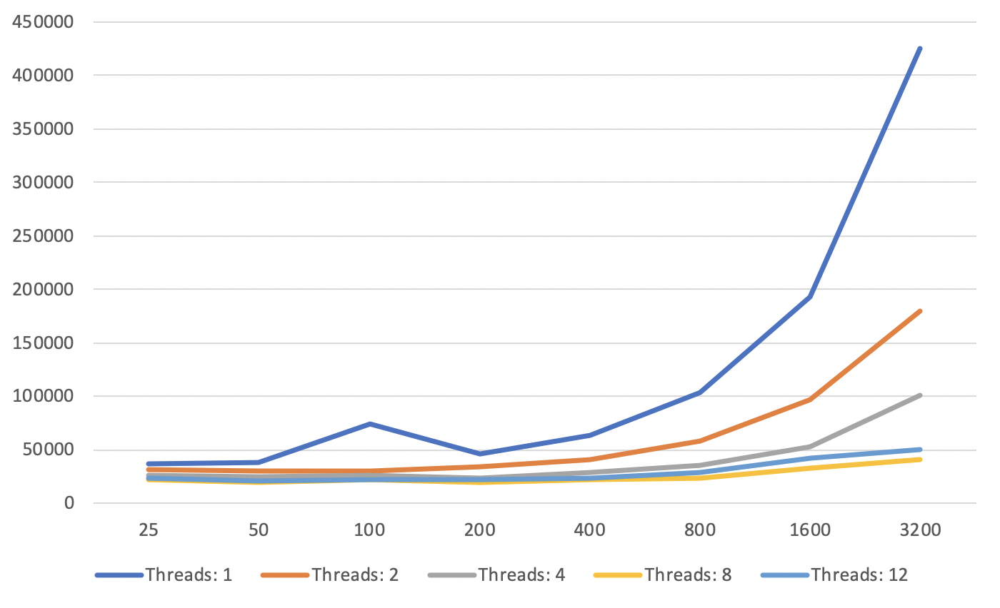
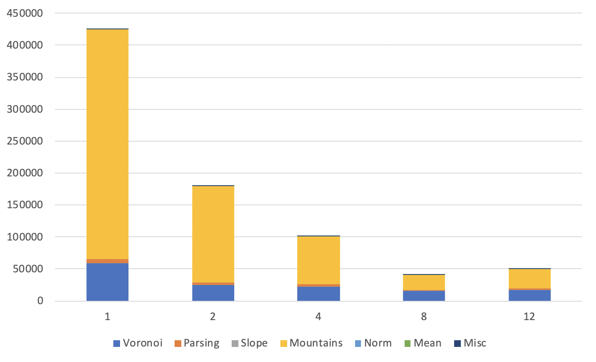

## Evolution Visualization
(Note: GIFs may need few seconds to load)

### Forward Evolution


### Backwards Evolution


## Execution

```
make mapgen
./mapgen -n [nVoxels] -m [nMountains], -t [nThreads]
```

### External Libraries & APIs

* [Generating Fantasy Maps (inspiration)](http://mewo2.com/notes/terrain/)
* [FortuneSweep Voronoi Generation](https://github.com/JCash/voronoi)
* [Graphics.py](https://mcsp.wartburg.edu/zelle/python/graphics.py)
* [Raylib](https://www.raylib.com)
* [EarCut Tesselation](https://github.com/mapbox/earcut)
* [OpenMP](https://www.openmp.org)

## Algorithm Design


BAbove is a block diagram of Generation and Rendering stages. Arrows showa linear set of dependencies in the program. CPU-executed components arein yellow, and GPU components are in green.


* **Voronoi** - Compute a random Voronoi Map of N voxels using the Fortune Sweep Library.
* **Parsing** - Iterate over the centroids and edges of the returned voronoi map and store them inthe custom map data structure. Allocate a zeroed out heightmap of the same size as the numberof voxels.
* **Slope** - Generate a random 2D vector representation of a line and compute the dot product of each voxel centroid to the the line. Store this distance in the voxel’s heightmap.
* **Mountain** - Generate M 2D mountain locations. For each voxel, compute the distance betweenthe voxel and mountain center.  The height increase as a result of the mountain is inversely proportional to this distance (closer voxels will have their height affected more by the mountain).
* **Normalize** - Retrieve the max and min value in the heightmap list. Subtract the min from each value in the heightmap, and divide by the difference between the max and min.
* **Mean** - Retrieve the mean of the heightmap list.
* **Render** - Compute the color for each voxel as a function of its height.  Before rendering each voxel, tessellate the polygon using the EarCut algorithm , and render each triangle using Raylib with the color computed from the voxel’s height.

### Performance

Results compouted on a 8 Core Linux machine.

Fig 1. Generation time in microsec as voxels increase, m=25.<br>


Fig 2. Generation time in microsec with n=320000, m=25.<br>


Fig 3. Generation time in microsec as mountains increase, n=32000.<br>


Fig 4. Generation time in microsec with n=320000, m=32000.<br>



## Gallery
