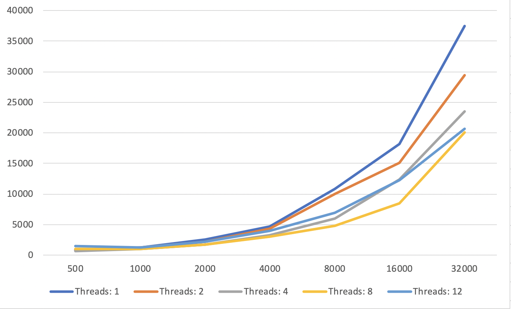

## Evolution Visualization
(Note: GIFs may need few seconds to load)

### Forward Evolution


### Backwards Evolution


## Execution

```
make mapgen
./mapgen -n [nVoxels] -m [nMountains], -t [nThreads]
```

### External Libraries & APIs

* [Generating Fantasy Maps (inspiration)](http://mewo2.com/notes/terrain/)
* [FortuneSweep Voronoi Generation](https://github.com/JCash/voronoi)
* [Graphics.py](https://mcsp.wartburg.edu/zelle/python/graphics.py)
* [Raylib](https://www.raylib.com)
* [EarCut Tesselation](https://github.com/mapbox/earcut)
* [OpenMP](https://www.openmp.org)

## Algorithm Design


### Performance


Fig 1. Generation time in microsec as voxels increase, m=25.<br>


Fig 2. Generation time in microsec with n=320000, m=25.<br>


Fig 3. Generation time in microsec as mountains increase, n=32000.<br>


Fig 4. Generation time in microsec with n=320000, m=32000.<br>

